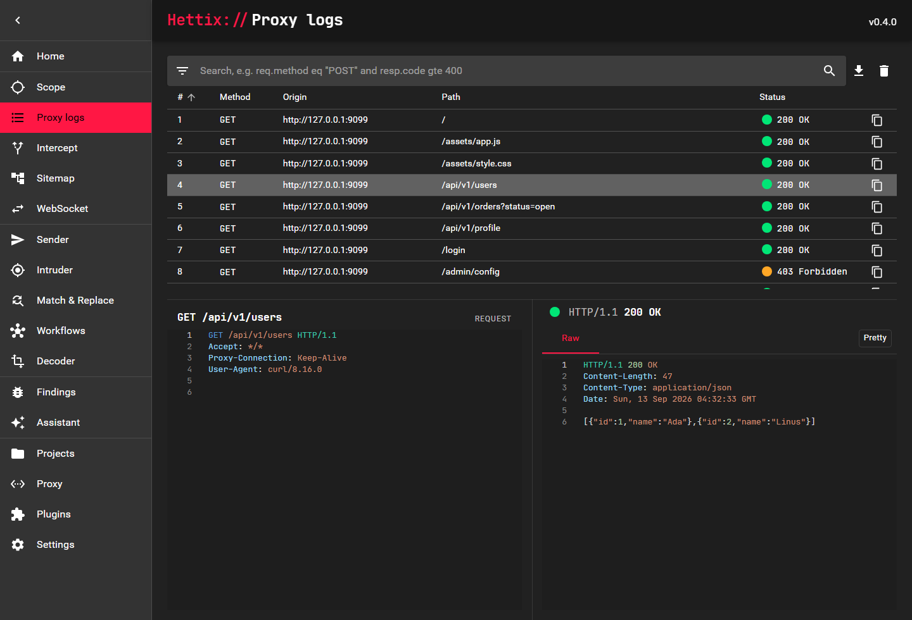
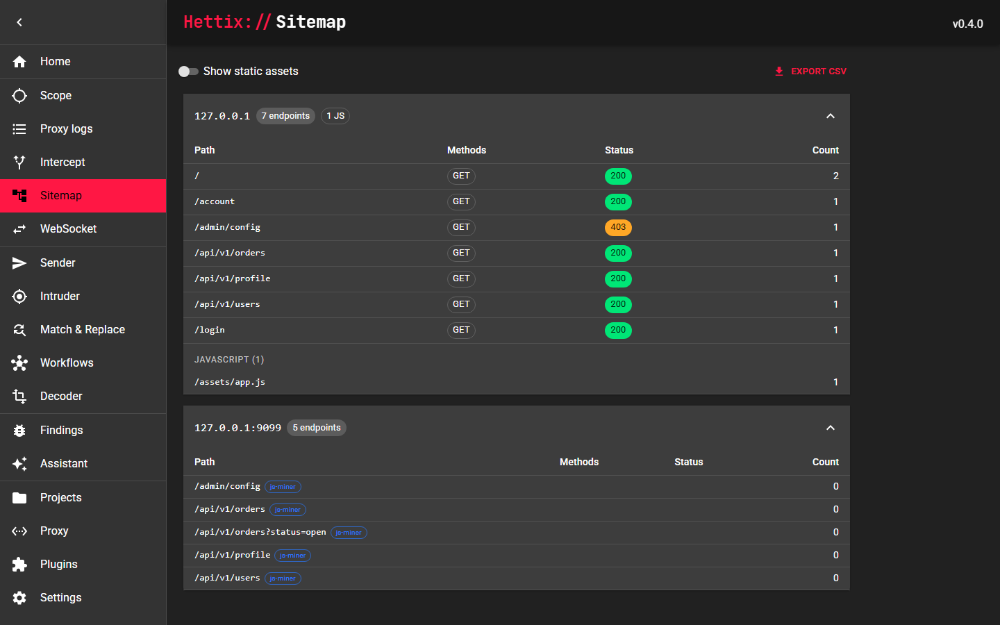
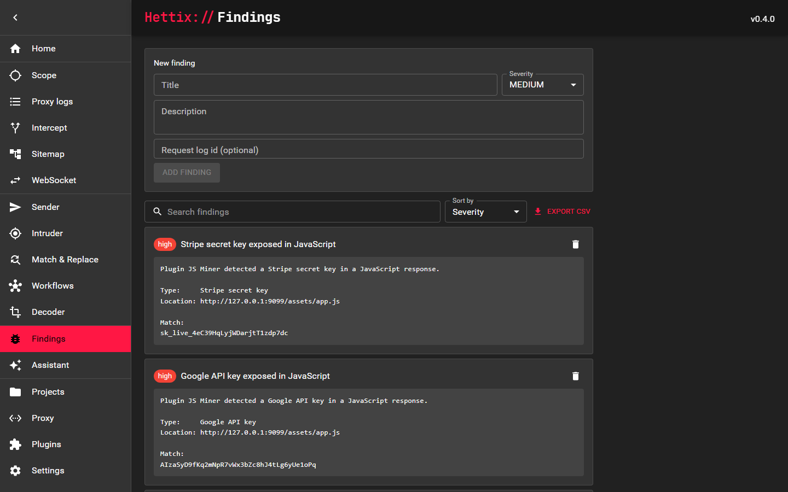
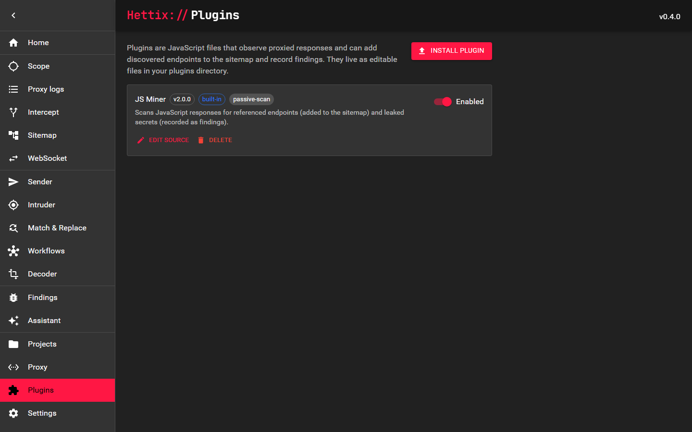

<h1 align="center">Hettix</h1>

<p align="center"><em>An HTTP toolkit for security research, evolving into an AI-driven pentest platform.</em></p>

<p align="center">
  <a href="https://github.com/Vibe-Coding-Base/Hettix/blob/main/LICENSE"></a>
  
  
</p>

**Hettix** is a machine-in-the-middle HTTP proxy for security research and bug
bounty work. It began as a revival of [Hetty](https://github.com/dstotijn/hetty),
an open-source proxy that had been dormant for years, and is being rebuilt into
a full security-assessment platform in the spirit of tools like
[Caido](https://caido.io) and Burp Suite — with one thing neither of them has at
its core: an **AI agent that can drive the assessment itself**.

## Vision

Hettix is more than a request logger. The goal is a tool where every capability
is exposed both to the operator and to a large language model, so you can hand a
goal to an assistant in plain language and have it plan, query traffic, replay
and mutate requests, and record findings — under scope enforcement and an
approval policy you control.

## Features

- **MITM proxy** — request/response logging with **HTTPQL**, a typed query
  language for filtering traffic that compiles to SQL
- **Interception** — pause, edit, forward or cancel requests and responses for
  manual review
- **Sender** — craft, edit and replay HTTP requests by hand
- **Intruder** — fuzz requests with wordlists loaded from file
- **Match & Replace** — rewrite traffic on the fly with rules
- **WebSocket** capture and interception
- **Sitemap**, **Scope** rules, and **Findings** tracking
- **Workflows** — chain search, fuzzing and findings into repeatable jobs
- **Decoder** — base64 / URL / hex / HTML, plus an in-editor right-click menu to
  decode selected text in place or send it to the Decoder
- **AI Assistant** — an LLM agent woven into every flow, backed by any
  OpenAI-compatible provider (DeepSeek, OpenAI, Ollama/local, and similar)
- **Native desktop app** for Windows, macOS and Linux
- **Bundled browser** — launch a pre-wired, pentest-optimised portable Chromium
  straight from the app, Burp-style
- **Plugins** — extend the tool with JavaScript plugins that observe traffic;
  ships with **JS Miner**, which mines JavaScript for endpoints and leaked
  secrets. Install, edit and remove plugins from the UI
- Project-based storage backed by SQLite

## Screenshots

<table>
  <tr>
    <td width="50%"><p align="center"><em>Proxy logs — ordered, sortable, HTTPQL search</em></p></td>
    <td width="50%"><p align="center"><em>Sitemap — endpoints discovered by plugins are tagged</em></p></td>
  </tr>
  <tr>
    <td width="50%"><p align="center"><em>Findings — secrets mined from JavaScript</em></p></td>
    <td width="50%"><p align="center"><em>Plugins — install, edit and toggle extensions</em></p></td>
  </tr>
</table>

## Getting started

The native **desktop app** is attached to each
[release](https://github.com/Vibe-Coding-Base/Hettix/releases): `Hettix-setup-*.exe`
(Windows installer), `Hettix_*_macos.dmg` (macOS), and, for Linux,
`Hettix_*_linux_amd64.deb` (Debian/Ubuntu installer) or `..._linux_amd64.tar.gz`
(other distros). Each bundles a pentest-ready Chromium; if it's missing the app
falls back to a system browser. Or build from source below.

### Prerequisites

- [Go](https://go.dev/dl/) 1.26 or newer
- [Node.js](https://nodejs.org/) and [Yarn](https://classic.yarnpkg.com/) (to build the admin UI)

### Build

The admin frontend is compiled to a static bundle and embedded into the app, so
`make` builds the frontend first:

```sh
make build-desktop  # native desktop app -> ./releases/ (Hettix.exe / Hettix / Hettix.app)
```

All build artifacts are written to `./releases`. The desktop app is built with
the [Wails](https://wails.io) CLI
(`go install github.com/wailsapp/wails/v2/cmd/wails@latest`); a plain `go build`
of the desktop package will not produce a working window. On Windows it is
frameless with a custom title bar; macOS and Linux use the native window frame.
Linux needs the WebKit dev packages (`libgtk-3-dev`, `libwebkit2gtk-4.1-dev`).

### Run

Launch the app from `./releases` (`Hettix.exe` on Windows), or install it from a
[release](https://github.com/Vibe-Coding-Base/Hettix/releases). The admin UI runs
in a native window; configure the proxy listener and manage plugins from inside
the app.

### Configure the AI assistant

The assistant works with any OpenAI-compatible provider (DeepSeek, OpenAI, a
local Ollama, and similar). Set the base URL, API key and model from the
**Settings** page inside the app.

### Windows installer

`scripts/build-installer.ps1` packages the desktop app together with the bundled
portable browser into an Inno Setup installer (written to `./releases/`). It
needs the [Wails](https://wails.io) CLI and [Inno Setup](https://jrsoftware.org/isinfo.php).

## Contributing

Contributions are welcome. See the [contribution guidelines](CONTRIBUTING.md)
and the [code of conduct](CODE_OF_CONDUCT.md).

## Acknowledgements

- Hettix builds on [Hetty](https://github.com/dstotijn/hetty) by David Stotijn
  and its contributors. The original project is MIT-licensed, and Hettix
  continues under the same license.
- The font used in the admin interface is [JetBrains Mono](https://www.jetbrains.com/lp/mono/).

## License

[MIT](LICENSE)
